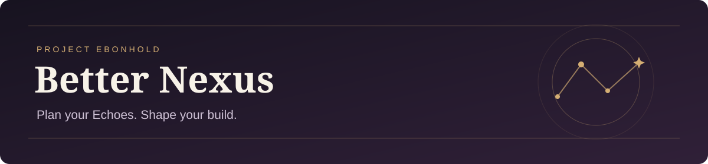

<p align="center">
  
</p>

<p align="center">
  <strong>Project Ebonhold · WoW 3.3.5a · Experimental public beta</strong>
</p>

<p align="center">
  <a href="https://github.com/Viscerals/Better-Nexus/releases">Downloads &amp; release notes</a> ·
  <a href="https://viscerals.github.io/Better-Nexus/preview/">Documentation preview</a> ·
  <a href="https://github.com/Viscerals/Better-Nexus/issues/new/choose">Report a problem</a> ·
  <a href="https://ko-fi.com/valentineb">Support on Ko-fi</a>
</p>

**Better Nexus** helps Project Ebonhold players plan Echo Wishlists, make rolling decisions, browse shared builds, and compare recorded DPS. It is a community-maintained continuation of the original Nexus addon, with upstream attribution preserved.

Set the qualities and copies you want, assign your Wishlist to a Saved Build, and review recommendations before enabling the automatic actions you choose. The installed addon keeps the name **Nexus** and its existing SavedVariables for compatibility with your setup.

## Download & status

The current public download is **[1.20.0-beta.1 · test.9092](https://github.com/Viscerals/Better-Nexus/releases/tag/v1.20.0-beta.1-test.9092)**. Choose **`Better-Nexus-test.9092-f95f68f.zip`** under that release's Assets; `SHA256SUMS.txt` is available beside it. This is an experimental prerelease.

Check [Releases](https://github.com/Viscerals/Better-Nexus/releases) for newer public tests and their specific limitations. The `main` branch is the maintained development line and may differ from a published package; a source checkout is not a player release. Download the packaged ZIP rather than GitHub's automatic source archives.

## Install or update

1. **Close the game.** Back up your existing `Nexus` and `NexusSupport` addon folders, if present, and the client's entire `WTF` folder somewhere outside the game directory. Keep that matching code-and-data backup before testing a beta.
2. Download the packaged ZIP from [Releases](https://github.com/Viscerals/Better-Nexus/releases) and extract it outside the client.
3. In your **Project Ebonhold client's** `Interface\AddOns` directory, replace the old `Nexus` and `NexusSupport` folders with **both folders from the same package**. Replace the addon folders completely so old files do not remain. Keep the names exactly as shipped; do not rename `Nexus` to `Better-Nexus`.
4. **Leave `WTF` and SavedVariables in place.** Preserve `NexusDB`, `WishlistRealizerDB`, and any `NexusSupportDB` report data. Updating addon code does not require deleting or resetting your saved data.
5. Start the game, enable Nexus in the AddOns list, then use **`/nexus help`**. Keep Automation off while checking your existing Wishlists, assignments, and settings. Disable competing Echo pickers before enabling Nexus automation.

The resulting layout should be:

```text
Interface/
└── AddOns/
    ├── Nexus/
    │   └── Nexus.toc
    └── NexusSupport/
        └── NexusSupport.toc
```

Avoid an extra `Nexus\Nexus` nesting level. `NexusSupport` stores prepared support reports and loads when needed; it does not need to appear as an always-loaded gameplay addon.

To roll back, close the game and restore the matching old addon folders **and** their saved-data backup together. A local backup cannot undo server-side actions, spent resources, or builds already shared with other players. Do not roll back during an unresolved Orb offer.

## What you can do

| Area | Tools in the public beta |
| --- | --- |
| **Wishlists & Saved Builds** | Create or import plans with exact qualities and copy counts, distinguish rolled copies from permanent-slot targets, and assign a plan to the intended Saved Build. |
| **Rolling** | Review Take, Freeze, Banish, and Reroll recommendations, then choose which automatic actions to permit. The experimental adaptive strategy is the current public default; the previous strategy remains selectable. |
| **Build Library & sharing** | Browse locally known builds and exchange build records through same-realm Sync. Pending, incomplete, refused, and unavailable results have distinct states. |
| **DPS & Leaderboards** | Capture and inspect Dummy and Lich King DPS records, browse rankings, and compare the recorded build context. Recorded DPS is evidence of that capture, not a guarantee of future results. |
| **Help & troubleshooting** | Reopen the in-game guide, inspect status and diagnostic logs, or prepare a support report with `/nexus report`. |
| **Orbs / Lost Memories** | An experimental Wishlist refinement workspace with explicit Start, a run cap, and Pause/Stop controls. Check the release notes and in-game capability/status messages before use; native resource-spending behavior is not established by offline tests. |

Wishlists, Saved Builds, and your Active Loadout serve different purposes. Start with the in-game guide to understand the workflow and action permissions.

## Documentation & commands

The **[documentation website preview](https://viscerals.github.io/Better-Nexus/preview/)** is a work in progress. Its content and visuals may differ from your installed build. Use the release notes for the exact package you downloaded and `/nexus help` for the guide shipped with it.

| Command | Purpose |
| --- | --- |
| `/nexus help` | Open the in-game guide. |
| `/nexus editor` | Open the Wishlist editor. |
| `/nexus builds` | Browse Community Builds / Build Library. |
| `/nexus leaderboard` | Open the DPS Leaderboard. |
| `/nexus status` | Show the loaded build and current build/loadout state. |
| `/nexus panel` | Show or hide the HUD. |
| `/nexus auto` | Toggle the master Automation permission. |
| `/nexus orbs` | Open Orbs / Lost Memories; opening the window does not start a run. |
| `/nexus log` | Open diagnostic logs. |
| `/nexus report` | Open the support-report window in public test.9092. |

The source repository also contains the [experimental player guide](README-PROTOTYPE.md) and [update-notice documentation](docs/UPDATE_NOTICES.md). Source documentation may describe a different development snapshot.

## Beta limitations & support

Better Nexus is unfinished software. Same-realm sharing still needs broader native testing, and **Stop Sharing cannot withdraw copies already held by other players**. Orb capabilities, resource spending, and UI behavior depend on the actual client/server. Offline tests do not prove native safety or performance, and the project does not claim that gameplay stutter is resolved. Consult the [release notes](https://github.com/Viscerals/Better-Nexus/releases) and [tracked issues](https://github.com/Viscerals/Better-Nexus/issues) for the build you use.

Support is limited and provided as time allows. There is no guaranteed response time, fix, future update, or continued compatibility. Feature suggestions can be recorded through the issue forms; new feature work remains secondary to prerelease stabilization.

### Troubleshooting

If the addon is missing, check the two folder paths above and confirm that you installed the release asset. If a feature stalls or behaves unexpectedly, stop the affected automation and preserve your saved data instead of resetting it.

1. Search [existing issues](https://github.com/Viscerals/Better-Nexus/issues) and choose the appropriate [Bug, Performance / Stutter, or Sync / Multiplayer form](https://github.com/Viscerals/Better-Nexus/issues/new/choose).
2. Include the **exact version and build label** from `/nexus status` or the ZIP filename, for example `1.20.0-beta.1 · test.9092-f95f68f`. “Latest” alone is not enough.
3. Describe the smallest reproduction, **what you observed versus what you expected**, whether it recurs after a reload, and relevant addons or existing-data upgrades. Include the complete Lua error if one appeared.
4. Open **`/nexus report`**. Use **Copy summary** and review the text before putting it in a public issue. **Prepare report file** stores a report for WoW to write at the next reload or logout; the window provides the file path and status. Preparing it does not prove the file is already on disk.

Keep full reports, SavedVariables, account data, and private logs **private**. Share those only through a verified private route agreed with the maintainer; do not attach them to public issues. Report vulnerabilities through [private vulnerability reporting](https://github.com/Viscerals/Better-Nexus/security/advisories/new), following [SECURITY.md](SECURITY.md). Further reporting guidance is in [SUPPORT.md](SUPPORT.md).

## Contributing

Read [CONTRIBUTING.md](CONTRIBUTING.md) before proposing changes. Preserve the `Nexus` runtime identity, Lua 5.1 / WoW 3.3.5a compatibility, and player data. Keep source changes on a focused branch and distinguish offline evidence from native testing.

<details>
<summary><strong>Development checks</strong> — Python 3.9+ and LuaJIT 2.1 on PATH</summary>

```sh
git clone https://github.com/Viscerals/Better-Nexus.git
cd Better-Nexus
python tools/ci_check.py
python tools/build_package.py --check
```

`ci_check.py` checks the test inventory and runs the offline suite. A bounded run such as `--only parse,boot` is reported as PARTIAL. Reference-dependent tests are **NOT RUN** without the authorized third-party archive described in [THIRD_PARTY.md](THIRD_PARTY.md); they are not counted as passes. The current extraction helper supplies the planner modules only, so the Orb reference also needs its required module before a complete reference-required run can pass.

Lua 5.4 runs with compatibility shims do not replace LuaJIT validation. Packaging checks never publish a release; publishing is a separate human-authorized step under [RELEASE_SECURITY.md](RELEASE_SECURITY.md). Include the exact native-testing status in every PR.

</details>

## Credits, license & optional support

Better Nexus continues Nexus, originally attributed to **Boganic**. See [UPSTREAM.md](UPSTREAM.md) and [THIRD_PARTY.md](THIRD_PARTY.md) for provenance and dependency terms, and [LICENSE.md](LICENSE.md) for the project's source-available license. Public source access does not grant unrestricted redistribution rights.

If you would like to support Valentine's work on Better Nexus, **[Ko-fi](https://ko-fi.com/valentineb)** is optional. Donations do not buy support priority or guarantee future work.
